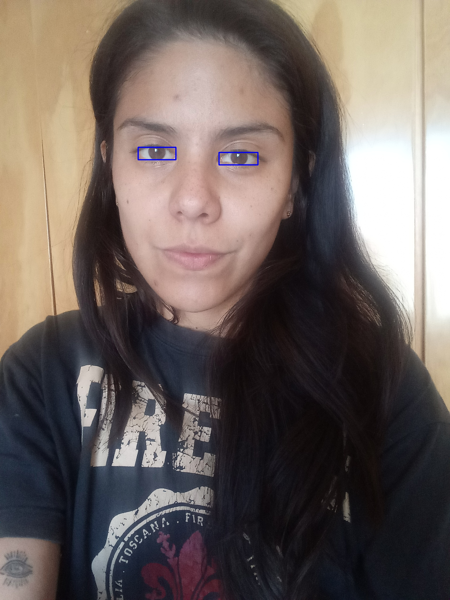

# Iris segmentation
## Abstract
This project aims to segment the iris and pupils in an image accurately.

## Limitations and assumptions
 There are a few limitations that limit my ability to gain optimal results.
### Limitations
 - As far as I know there is no labeled database for iris segmentation in selfie settings
 - No easily available dataset for eye detection or iris segmentation, These databases do exist, but they are not publicly available, and using it requires the consent of the database owner
- I haven't found a deep learning model for eye segmentation.
### Assumptions:
 - The iris is clearly visible in the image
 - There is only one subject in the image

# Project proposal

The project is divided into two main parts, the detection phase, and the segmentation phase.

## Detection
The detection phase goal is to give the bounding box that contains each eye in the image.
there are two detectors that I've used in this project:
### OpenCV haar cascade
Object detection using Haar feature-based cascade classifiers proposed by Paul Viola and Michael Jones in their paper, "Rapid Object Detection using a Boosted Cascade of Simple Features" in 2001.
 
This detector is relatively weak and there are some post-processing that was used to increase its accuracy  

### Dlib face keypoint detector
This detector is the DLIB face landmark model, this model is much more accurate and users are encouraged to use it.
<!--  -->

## Segmentation
I've used a working git of a [UNET based segmentation network](https://github.com/milesial/Pytorch-UNet.git)
The main difference between the original UNET network and this git is that they didn't implement the skip connection.

## Dataset
### Base dataset
As there is no easily available Iris segmentation dataset,
a dataset with similar characteristics to an image could be a good starting point.

I've found [synthetic human eyes ](https://www.kaggle.com/datasets/allexmendes/synthetic-human-eyes) dataset.
This dataset contains around 50k images of simulated human eyes in different poses.

### Modified dataset
We wish that the synthetic dataset will resemble as much as possible the real-world data we will infer on.
also, on of the challenges of using simulated data is the model can sometimes use artifacts that exist in the data to get better results.
to mitigate this I only used the area surrounding the eye and converted the image to gray  to avoid coloration artifacts.
( most of the information we need to find an iris its the structure if each object and to a lesser so on its color)
the new model will only require identifying the iris and pupil as the same class.

### Dataloader
In order to optimize the running time of the training and to allow batch size > 1
each image is resized to a constant size width 160px height 60px.

### Loss
The loss is a combination of binary cross entropy and dice loss,
where the dice loss:

$L_{dice}=  \frac{2 TP}{2TP + FP + FN} $

The dice loss is mainly for imbalanced data where the ratio of foreground pixels is considerably smaller than the background pixels, in our case it may have been unnecessary.

### Inference

## Ground Truth:
In order to evaluate the results I've modified the OpenCV's GrabCut annotation tool to create ground truth results for each subject.
[annotations](/gt/annotations)
[grab cut tool](utils/grabcut.py)

## Evaluation  
Using the ground truth I can evaluate the result of each run.
the metrics that I'm interested in are:
- Precision
- Recall: Percentage of Iris detected
- Intersection over union: The combination between the above two metrics.
## Results:

[opencv](out/opencv_haar/debug/evaluation/results.csv)

[dlib](out/dlib/debug/evaluation/results.csv)

The visual results can be seen in:
[results](out)
The directories are organized as follows:
- run name  
	- debug
    	- evaluation: The evaluation metrics of the run
    	- images: Shows all the phases of the algorithm for each subject in one image.
	- blend: shows the final result combining the mask and the image
	- mask the final mask for each subject.

